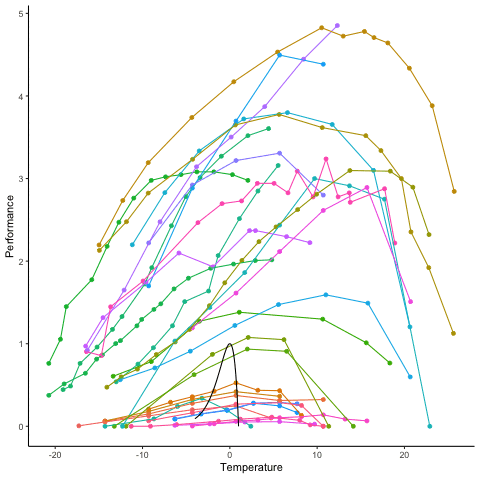

## Setup

```{r}
# load required libraries
# install them if necessary (more than likely you wont have them)
# install.packages(c("berryFunctions","animation"))
library(ggplot2)
library(gganimate)
library(tidyverse)
library(magrittr)
library(readxl)
library(patchwork)
```

Define our uTPC function 

```{r}
utpc_fun <-  function(x){y <- (1-x) * exp(x)}

utpc_raw <-  function(x){y <- (1-x) * exp(x)}
```


## Import 

all the TPC data

```{r}
load(file = "output/combined_dat_params.rda")
```

a subset to test code

```{r}

# extract a subset of experiments for this illustration
dd <- combined_dat_params %>% 
  select(type, ta, pf, code, 
         u_yopt, u_Topt, u_Delta, u_Tc) %>% 
  split(.$code)
dd <- dd[sample(30)] %>% bind_rows()

# recentre around the grand mean temperature
corr_ta <- mean(dd$ta)
dd %<>% mutate(ta = ta - corr_ta, 
               u_Topt = u_Topt - corr_ta,
               u_Tc = u_Tc - corr_ta)


xx <- seq(-4, 1, length.out = 100)

yy_raw <- utpc_fun(xx) * dd$u_yopt[1]

xx_raw <- (xx  * (dd$u_Tc[1] - dd$u_Topt[1])) + dd$u_Topt[1]

dd_raw <- tibble(xx_raw, yy_raw)

dd_uTPC <- tibble(xx = seq(-4, 1, length.out = 100),
                  yy = utpc_fun(xx))

# make_tpc_fun <- function(x){
#   
# }
# 
# dd_raw <- dd $>$ 
#   split(.$code) $>$ 
#   map()

```


## Initial plots

Here I start by centering the TPC data around the grand mean for the data in the sample so as to start them close to 0. 

```{r}
g_1 <- ggplot(data = dd, 
                mapping = aes(x = ta, y = pf)) + 
  geom_point(aes(color = code)) + 
  geom_line(aes(color = code)) + 
  scale_color_discrete(guide="none") + 
  theme_classic() + 
  # facet_wrap(vars(type), scales = "free_y") + 
  xlab("Temperature") + 
  ylab("Performance") + 
  geom_line(data = dd_uTPC, 
            mapping = aes(x = xx, y = yy))

print(g_1)

```


## Animate the transition

```{r}

# the proportion along the transformation vector to apply at iteration
pp <- seq(0, 1, length.out = 5)


# setup all the frames of the animation
# aj <- map_dfr(pp[2:length(pp)], function(pp){
#   dd %>% 
#     mutate(ta = (ta - pp*u_Topt)/((1-pp)*(u_Tc - u_Topt)),
#            pf = pf / (pp*u_yopt))
# },.id = "frame") %>% mutate(frame = as.numeric(frame))


aj <- bind_rows(dd %>% mutate(frame = 1), 
                dd %>% mutate(frame = 2, 
                              ta = (ta - u_Topt)/(u_Tc - u_Topt),
                              pf = pf / u_yopt))

# plot and animate using gganimate::transition_states()
g_2 <- ggplot(data = aj, 
                mapping = aes(x = ta, y = pf)) + 
  geom_point(aes(color = code)) + 
  geom_line(aes(color = code)) + 
  scale_color_discrete(guide="none") + 
  theme_classic() + 
  # facet_wrap(vars(type), scales = "free_y") + 
  xlab("Temperature") + 
  ylab("Performance") + 
  geom_line(data = dd_uTPC, 
            mapping = aes(x = xx, y = yy)) + 
  transition_states(frame, 
                    transition_length = 3, 
                    state_length = 3) 
  # scale_x_discrete("Temperature", seq(-10,10, 10), seq(-10,10, 10), limits)
  # view_follow()


# print to screen
anim_save(file = "output/animate_uTPC.gif", animation = g_2)


```



## Plot just the first and last frames

```{r}

# plot and animate using gganimate::transition_states()
a_1 <- ggplot(data = aj %>% filter(frame == 1), 
                mapping = aes(x = ta, y = pf)) + 
  geom_point(aes(color = code)) + 
  geom_line(aes(color = code)) + 
  scale_color_discrete(guide="none") + 
  theme_classic() + 
  # facet_wrap(vars(type), scales = "free_y") + 
  xlab("Temperature") + 
  ylab("Performance") + 
  geom_line(data = dd_uTPC, 
            mapping = aes(x = xx, y = yy))

a_2 <- ggplot(data = aj %>% filter(frame == 2), 
                mapping = aes(x = ta, y = pf)) + 
  geom_point(aes(color = code)) + 
  geom_line(aes(color = code)) + 
  scale_color_discrete(guide="none") + 
  theme_classic() + 
  # facet_wrap(vars(type), scales = "free_y") + 
  xlab("Temperature") + 
  ylab("Performance") + 
  geom_line(data = dd_uTPC, 
            mapping = aes(x = xx, y = yy))

print(a_1 | a_2)


```


## Deconstruct the UTPC

This figure helps to visualise how the prefactor (red line $(1-x)$ ) interacts with the exponential function (blue line) to generate the UTPC (black line).

```{r}

x <- seq(-5, 1, length.out = 100)


decon <- tibble(x) %>% 
  mutate(                y1 = (1-x), 
                         y2 = exp(x),
                         yy = y1 * y2)

gg_5 <- ggplot(data = decon, 
               mapping = aes(x = x, y = y1)) + 
  geom_line(color = "red", linetype = 2) + 
  geom_line(mapping = aes(y = y2), color = "blue", linetype = 2) +
  geom_line(mapping = aes(y = yy)) + 
  ylim(0,3)
          

print(gg_5)


```


